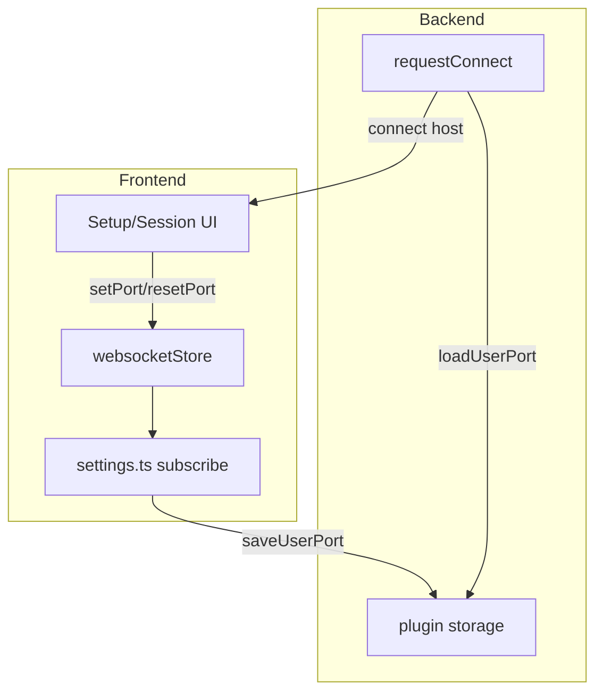
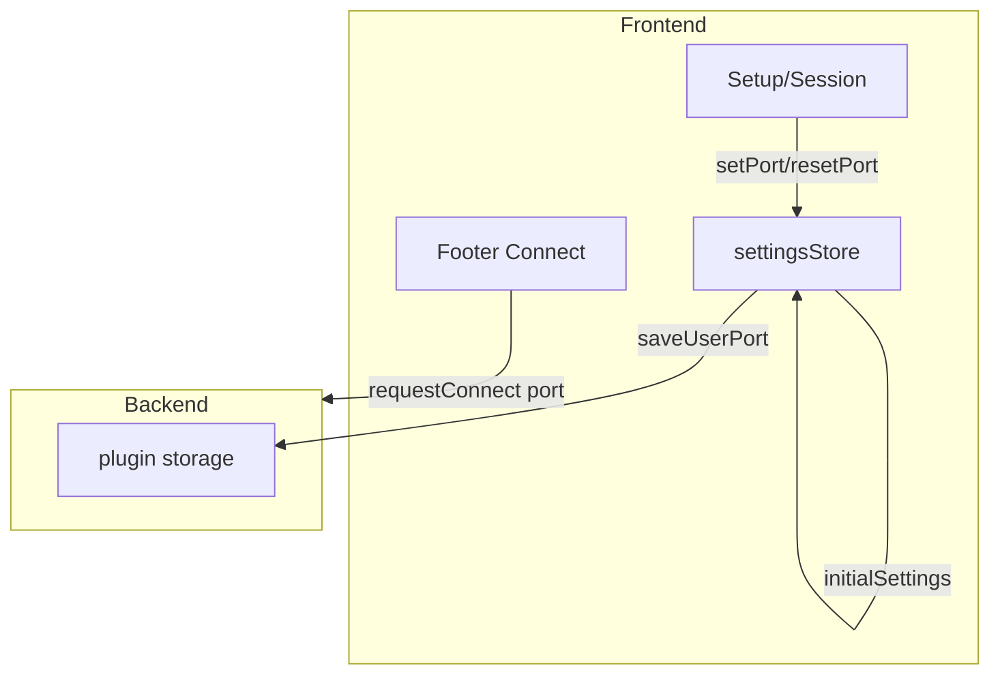

# Settings store refactor: single source of truth

**Date:** 2026-03-14

## Problem

1. **Bug**: After port reset (empty input), connection and health still use the old user port. Root cause: backend handler rejected `port: null` (fixed separately).

2. **Architecture**: Two overlapping stores cause sync issues:
   - `websocket.ts` — holds `userPort`, `owner`, `defaultPort`; used by Setup, Session (health)
   - `settings.ts` — subscribes to websocketStore, syncs to backend via `saveUserPort`; used by App (side-effect only)

3. **Two sources of truth**:
   - Frontend store: UI state, health check port
   - Backend storage: actual connection port (via `loadUserPort` on `requestConnect`)
   - Sync is one-way (frontend → backend on change), but backend never reads frontend on connect.

## Current flow



**Gap**: `requestConnect` ignores frontend state and reads only from storage. If sync hasn't completed or handler rejected the update, wrong port is used.

## Proposed architecture

### 1. Merge stores into single `settings` store

| Current | Merged |
|--------|--------|
| `websocket.ts` (state + actions) | `settings.ts` (state + actions + sync) |
| `settings.ts` (sync only) | — |

**New `settings.ts`**:
- State: `defaultPort`, `userPort`, `owner`, `lastScreen` (if needed later)
- Actions: `setPort`, `resetPort`
- Sync: `initialSettings` → hydrate; subscribe → `saveUserPort` on change
- Hook: `useSettings()` returns snapshot + actions

**Remove**: `websocket.ts`, `useWebsocket()`

### 2. Frontend as source of truth for connection

Change `requestConnect` to carry the port from frontend:

```ts
// events.d.ts
| { event: "requestConnect"; data: { port: number } }
```

- Frontend computes `effectivePort = userPort ?? defaultPort` and sends it.
- Backend uses `data.port` directly for `connect` — no `loadUserPort` on connect.
- Storage remains for persistence: load on `ready` → `initialSettings`, save on port change.



**Benefits**:
- Single source of truth: frontend store
- No sync race: connect uses current UI state
- Health and connect use the same port
- Storage is persistence only, not connection logic

### 3. Implementation steps

1. **Fix backend handler** (done): accept `port: null` in `saveUserPort`.

2. **Add port to requestConnect**:
   - `events.d.ts`: `requestConnect` data `{ port: number }`
   - `footer.tsx` / `mini.tsx`: get `effectivePort` from store, pass in `post("requestConnect", { port })`
   - `main.ts`: use `data.port` instead of `loadUserPort(userHash)`

3. **Merge stores**:
   - Move websocket state + actions into `settings.ts`
   - Delete `websocket.ts`
   - Replace `useWebsocket()` with `useSettings()` in Setup, Session

4. **Optional**: Rename `userPort`/`owner` to clearer names (e.g. `portOverride`, `useDefaultPort`) if desired.

## Implementation (done 2026-03-14)

| File | Change |
|------|--------|
| `lib/events.d.ts` | `requestConnect` and `takeOver` data: `{ port: number }` |
| `backend/main.ts` | Use `data.port` in handleRequestConnect; remove loadUserPort from connect flow |
| `frontend/stores/settings.ts` | Merged: state, actions, sync; single useSettings() hook |
| `frontend/stores/websocket.ts` | Deleted |
| `frontend/components/layout/footer.tsx` | Pass port in requestConnect |
| `frontend/components/screens/mini.tsx` | Pass port in requestConnect |
| `frontend/components/screens/duplicated.tsx` | Pass port in takeOver |
| `frontend/components/screens/setup.tsx` | useSettings instead of useWebsocket |
| `frontend/components/screens/session.tsx` | useSettings instead of useWebsocket |
